# Architectural Blueprint: Cross-Platform Reminder Daemon

This document outlines the architectural blueprint, platform-specific strategies, data structures, and phased rollout plan for a single-codebase cross-platform background reminder daemon (`full-calendar-remastered-ReminderApp`).

---

## 1. Motivation & Goals

The [Full Calendar Remastered](file:///d:/Codes/plugin-full-calendar/obsidian-dev-vault/.obsidian/plugins/full-calendar-remastered) Obsidian plugin provides a calendar and event management interface. However, Obsidian is a heavy client app, not a background service. When a user closes Obsidian, all active reminder timers are terminated.

To guarantee that users receive time-sensitive alerts, we need a lightweight background daemon that:
1. **Runs in the background** with minimal resource consumption.
2. **Integrates natively** with OS-specific notification systems.
3. **Accepts reminder updates** directly from the Obsidian plugin.
4. **Maintains a single codebase** in Rust for maximum cross-platform reuse and minimal maintenance.

---

## 2. Core Architectural Philosophy: The "Dumb" Client App

To simplify the daemon's codebase and ensure cross-platform consistency, we follow the **Dumb Client Principle**:
* **No parsing of complex structures:** The Rust daemon does not parse `.ics` files or compute recurring rules (RRule).
* **Obsidian is the source of truth:** The Obsidian plugin parses events, computes recurrence instances, and pushes a flat list of simple, pre-calculated future reminder instances.
* **Epoch-based triggers:** Reminders are triggered purely by comparing the current system time to a flat Unix Epoch timestamp (`trigger_at_epoch`).
* **Headless execution:** The app has no primary GUI. On desktops, it is managed via a system tray icon. On mobile, it is entirely invisible, acting as an OS background integration task triggered via Deep Links.

---

## 3. Communication Architecture

The daemon handles communication differently depending on the operating system's sandbox and background execution rules.

```mermaid
graph TD
    subgraph Desktop [Desktop: Windows / Linux / macOS]
        O_D[Obsidian Plugin] -->|HTTP POST JSON| HTTP[Local HTTP Server: Port 45677]
        HTTP -->|Schedule| RD[Rust Daemon Loop]
        RD -->|Wait / Sleep| Trigger[Trigger Time reached]
        Trigger -->|Native API| Notif_D[OS Toast Notification]
    end

    subgraph Mobile [Mobile: Android / iOS]
        O_M[Obsidian Plugin] -->|Deep Link Link Intent| DL[fullcalendar-reminder://sync?payload=...]
        DL -->|Wake & Parse| MobileWrapper[Native Wrapper: Kotlin/Swift]
        MobileWrapper -->|Pass Payload| RustCore[Rust Core Library]
        RustCore -->|Process & Return| MobileWrapper
        MobileWrapper -->|Schedule exact alarm| OSAlarm[OS Alarm Manager / APNS]
        OSAlarm -->|Wake at timestamp| Notif_M[OS Native Notification]
    end
```



### 3.1. Desktop Communication (Windows, Ubuntu, macOS)
* **Protocol:** HTTP over TCP.
* **Endpoint:** `http://localhost:45677/sync` (Port can be configured via environment variables or a configuration file).
* **Mechanism:** The Rust daemon runs a lightweight asynchronous HTTP server. When Obsidian loads or events are modified, it performs an HTTP `POST` request to `/sync` with the JSON payload.
* **Security:** Binds strictly to `127.0.0.1` so it is inaccessible from the external network.

### 3.2. Mobile Communication (Android, iOS)
* **Protocol:** Custom URI / Deep Link intent.
* **Scheme:** `fullcalendar-reminder://sync?payload=<base64_json>`
* **Mechanism:** Mobile operating systems will kill local background HTTP servers. When the user initiates a sync in the Obsidian mobile app, the plugin opens the deep link. The OS launches the native reminder app wrapper, passes the payload, registers native OS alarms, and immediately shuts down.

---

## 4. Payload Specification

The JSON payload sent from the Obsidian plugin is a flat JSON array of active future reminder instances.

```json
[
  {
    "id": "event-123",
    "title": "Meeting with John",
    "body": "Discuss the new architecture",
    "trigger_at_epoch": 1716388800,
    "action_url": "obsidian://open?vault=MyVault&file=Calendar/event-123"
  }
]
```

### Field Definitions

| Field Name | Type | Description |
| :--- | :--- | :--- |
| `id` | `String` | Unique identifier for the reminder (usually derived from the event ID). |
| `title` | `String` | The title header for the push notification. |
| `body` | `String` | The detailed content of the notification. |
| `trigger_at_epoch` | `i64` | Unix Epoch timestamp (in seconds) when the notification must fire. |
| `action_url` | `String` | The deep-link URL triggered when the user clicks the notification. |

---

## 5. Single Codebase & Monorepo Architecture

To avoid maintaining multiple divergent repositories, we structure the workspace as a Cargo monorepo. This allows us to share core schemas, SQLite storage wrappers, and event scheduling algorithms across all platforms while maintaining slim, target-specific entry points.

```
full-calendar-remastered-ReminderApp/
├── Cargo.toml                  # Workspace configuration
├── blueprint.md                # This blueprint
├── reminder_core/              # Shared Rust Core logic (compiled for all platforms)
│   ├── Cargo.toml
│   └── src/
│       ├── lib.rs              # Main UniFFI interfaces
│       ├── storage.rs          # Shared SQLite / File storage for reminders
│       ├── scheduler.rs        # Core timer queue logic (Desktop-specific)
│       └── models.rs           # Shared models & serialization/deserialization
├── desktop/                    # Desktop entry point (Executable)
│   ├── Cargo.toml
│   └── src/
│       ├── main.rs             # Tokio HTTP server, tray icon setup
│       ├── platform/
│       │   ├── windows.rs      # WinRT Toast notification integrations
│       │   ├── linux.rs        # notify-rust DBus integrations
│       │   └── macos.rs        # mac-notification-sys integrations
├── android/                    # Android Project (Kotlin Native Wrapper)
│   ├── app/
│   │   └── src/main/java/      # Kotlin deep link receiver & AlarmManager logic
│   └── rust-bridge/            # uniffi generated JNI headers and libraries
└── ios/                        # iOS Project (Swift Native Wrapper)
    ├── App/                    # Swift deep link handler & UNUserNotificationCenter
    └── RustBridge/             # uniffi generated Swift/C headers and static library
```

---

## 6. Platform Implementation Details

### 6.1. Windows (Priority 1)
* **Aesthetic Focus:** Modern, premium Windows 10/11 Toast Notifications.
* **Libraries:**
  * `winrt-notification` to construct native XML-based Windows toasts.
  * `tray-icon` for a sleek system tray presence with a context menu (Open Vault, Sync Status, Quit).
  * `tokio` as the async runtime for scheduling timers.
* **Mechanism:**
  * When a payload is received, the app updates its local SQLite/file store.
  * A background Tokio task polls/sleeps until the nearest `trigger_at_epoch`.
  * On wake, it triggers a native Toast notification. Clicking the toast triggers a command to open the `action_url` in the default handler (opening Obsidian directly to the event).

> [!NOTE]
> Since the daemon needs to survive user logouts, it should be registered to run on user startup. This can be handled by creating a registry entry in `Software\Microsoft\Windows\CurrentVersion\Run`.

### 6.2. Android (Priority 2)
* **Background Strategy:** Custom intent listener and native alarm framework.
* **Libraries:**
  * Mozilla `uniffi` to export Rust logic to Kotlin JNI.
* **Mechanism:**
  1. The Obsidian plugin triggers the deep link scheme `fullcalendar-reminder://sync?payload=...`.
  2. Android wakes up our Kotlin application (`MainActivity`).
  3. `MainActivity` extracts the Base64 payload, parses it into an array, and passes it to the Rust core via UniFFI.
  4. The Rust core persists the reminders in a local SQLite file (shared directory) and returns the upcoming reminder times back to Kotlin.
  5. The Kotlin code iterates through the upcoming triggers and calls `AlarmManager.setExactAndAllowWhileIdle()`.
  6. When the alarm fires, Android wakes up a custom `BroadcastReceiver` that triggers a native `NotificationCompat` with the corresponding title, body, and action URL intent.

> [!IMPORTANT]
> Mobile operating systems vigorously kill continuous background processes. The only way to guarantee minute-perfect reminders on Android is to use native `AlarmManager` with `setExactAndAllowWhileIdle()`. Trying to run a persistent Rust thread on Android *will* fail.

### 6.3. Ubuntu / Linux (Priority 3)
* **Background Strategy:** Persistent daemon managed by `systemd`.
* **Libraries:**
  * `notify-rust` using the DBus transport to send standard Freedesktop notifications.
  * `tray-icon` using GTK/AppIndicator backend for system tray rendering.
* **Mechanism:**
  * Leverages the same Tokio-based HTTP server logic as Windows.
  * Fires system notifications via `notify-rust` and DBus.
  * Installs a `systemd` user service (at `~/.config/systemd/user/fullcalendar-reminder.service`) for persistent auto-start on user login.

### 6.4. Apple Ecosystem: macOS & iOS (Priority 4)
* **macOS:**
  * Runs the standard HTTP server loop.
  * Integrates notifications via `mac-notification-sys`.
  * Set up as a standard launchd agent.
* **iOS:**
  * Works like Android. Uses a custom URL scheme.
  * The Swift wrapper uses Apple's native `UNUserNotificationCenter` to schedule local notifications at the exact target epochs.
  * Requires no active background threads because Apple handles local scheduling efficiently.

---

## 7. Build and Cross-Compilation Pipeline

To maintain a robust build process without complex configuration issues:
1. **Targeting Windows from Windows/Linux:** Use standard target triples `x86_64-pc-windows-msvc`.
2. **Targeting Android:** We will use `cargo-ndk` to cross-compile our shared core library to `aarch64-linux-android`, `armv7-linux-androideabi`, `i686-linux-android`, and `x86_64-linux-android`.
3. **Targeting Linux:** Use `cross` or native compilation on an Ubuntu virtual machine.
4. **Automated CI/CD:** Set up GitHub Actions to build release binaries automatically on tag creation.

---

## 8. Detailed Phased Rollout Plan

To ensure rapid and stable execution, we will build out the components in a highly structured order:

### Phase 1: Windows Native Desktop Daemon (Current Objective)
* [ ] **Step 1:** Establish the basic Cargo monorepo workspace.
* [ ] **Step 2:** Write the `reminder_core` library with models and database storage.
* [ ] **Step 3:** Implement the HTTP server and endpoint in `/desktop`.
* [ ] **Step 4:** Build the local scheduler (Tokio thread-based timers).
* [ ] **Step 5:** Add native Windows notification triggers via `winrt-notification`.
* [ ] **Step 6:** Design and implement a beautiful system tray integration with custom icons and basic configuration support.
* [ ] **Step 7:** Compile, verify, and document manual testing instructions on Windows.

### Phase 2: Android Native Port
* [ ] **Step 1:** Set up `uniffi` bindings for the `reminder_core` crate.
* [ ] **Step 2:** Build the Kotlin wrapper shell.
* [ ] **Step 3:** Implement the Deep Link Intent handler.
* [ ] **Step 4:** Set up SQLite shared storage.
* [ ] **Step 5:** Write the native AlarmManager scheduling and notification logic.

### Phase 3: Ubuntu / Linux Desktop Port
* [ ] **Step 1:** Enable GTK AppIndicator features in `tray-icon`.
* [ ] **Step 2:** Integrate DBus notification triggers via `notify-rust`.
* [ ] **Step 3:** Write standard `systemd` user service config templates.

### Phase 4: Apple Ecosystem Port (macOS & iOS)
* [ ] **Step 1:** Add macOS launcher scripts and notification handlers.
* [ ] **Step 2:** Construct the Swift wrapper project for iOS, linking standard Rust library exports.

---

## 9. Next Steps

With this blueprint locked in place, we can begin work on **Phase 1: Windows Native Desktop Daemon**. 

To begin, we will:
1. Initialize the workspace `Cargo.toml`.
2. Create the `reminder_core` package directory.
3. Create the `desktop` package directory.

---

## 10. The Clean Slate Philosophy

We enforce a strict **Clean Slate Philosophy** as an architectural law for the FCR Reminder daemon across all platform wrappers (Windows, Linux, macOS). 

### 10.1. Design Core Rules
1. **Zero Unmanaged Leftovers:** When the application is removed or the uninstallation / cleanup command is executed, the OS must be left in a 100% clean state. No hidden directories, no unmanaged logs, no orphaned registry subkeys, and no system startup loops.
2. **Explicit User Consent:** Modifying startup entries or deep link system associations is done automatically to ensure zero friction, but the cleanup process must comprehensively purge them.
3. **Explicit Cleanup CLI Option:** The core desktop daemon must support a dedicated CLI option `--cleanup` (shortkey `-c` or `--uninstall`) that handles:
   * **Registry Purging:** Deletion of the custom toast notification registry subkey (`HKCU\Software\Classes\AppUserModelId\FCRReminder`) and the startup run registration subkey (`HKCU\Software\Microsoft\Windows\CurrentVersion\Run\FCRReminder`).
   * **AppData Purging:** Complete recursive deletion of the local application directory containing databases, log files, and extracted resources (`C:\Users\<Username>\AppData\Local\fullcalendar\ReminderApp`).
4. **Developer Environment Hygiene:** In debug/developer builds, all files (logs, database, etc.) must remain isolated within the repository-local `/dev` directory to avoid polluting the developer's actual production application data.

### 10.2. Platform Cleanup Matrices

| Platform | Autostart Method | App State Directory | Cleanup Action |
| :--- | :--- | :--- | :--- |
| **Windows** | Registry `Run` Key (`HKCU\...\Run\FCRReminder`) | `C:\Users\<User>\AppData\Local\fullcalendar\ReminderApp` | Deletes both Registry keys (`Run` and `AppUserModelId`) and deletes AppData recursively. |
| **Linux (Ubuntu)** | `systemd` User Agent (`~/.config/systemd/user/`) | `~/.local/share/fullcalendar-reminder/` | Unregisters and deletes systemd service files, deletes standard desktop shortcut entries, and deletes local share data. |
| **macOS** | `launchd` plist Agent (`~/Library/LaunchAgents/`) | `~/Library/Application Support/fullcalendar-reminder/` | Unloads and deletes plist launch agents, and deletes Application Support directories. |

