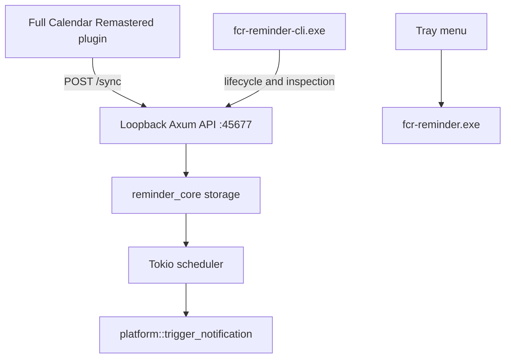

# Runtime Overview

!!! abstract "Runtime Overview"
    This page explains what the daemon is, what it owns, and how the primary runtime pieces fit together. Use the [Architecture Docs router](index.md) when you need the decision matrix and page selection first.

## 1. System Purpose

FCR Reminder is a local reminder daemon for Full Calendar Remastered.

Core responsibilities:

1. receive flat reminder instances from the host plugin
2. persist them locally
3. schedule the next reminder efficiently
4. expose local lifecycle and inspection commands
5. trigger native platform notifications when reminders fire

## 2. Architectural Rules

The current implementation follows these rules:

- the host computes reminder instances; the daemon does not parse recurrence rules
- the daemon is local-only and binds to `127.0.0.1:45677`
- Windows release builds are tray-first and GUI-subsystem based
- terminal operations are routed through a separate CLI companion binary
- Windows-specific behavior is isolated under `src/desktop/src/platform/windows`

!!! note "Single Source of Truth"
    The daemon owns reminder storage and scheduling once the host pushes a `/sync` payload. The host remains responsible for recurrence expansion and future-instance generation.

## 3. Process Model

The desktop crate produces two binaries on Windows:

- `fcr-reminder.exe`
  - primary tray daemon
  - GUI subsystem in release mode
  - owns the HTTP server, scheduler, tray, and platform registration
- `fcr-reminder-cli.exe`
  - console companion
  - forwards lifecycle and inspection commands to the daemon or launches it when needed

On duplicate daemon launch, `fcr-reminder.exe` detects that `127.0.0.1:45677` is already in use and exits after confirming a healthy existing daemon instance.

## 4. High-Level Flow

## 5. Main Runtime Components

### 5.1 `reminder_core`

Shared responsibilities:

- `models.rs`: reminder payload model
- `storage.rs`: app-directory resolution and reminder persistence
- `logger.rs`: file-backed logging and console logging helpers

Storage behavior:

- debug and test builds use workspace-local development storage
- release builds use `AppData/Local/fullcalendar/ReminderApp/data` on Windows

### 5.2 `src/desktop/src/main.rs`

Owns the platform-agnostic daemon control flow:

- argument parsing
- early single-instance check
- Axum router setup
- scheduler task startup
- tray thread bootstrap
- lifecycle command execution
- inspection command execution

### 5.3 Platform Layer

`src/desktop/src/platform/mod.rs` provides the common platform surface.

Current exported responsibilities include:

- `init()`
- `cleanup()`
- `prepare_console_for_cli()`
- `trigger_notification()`
- `doctor_checks()`
- `run_event_loop()`
- `show_about_dialog()` on Windows

Windows-specific implementations live in:

- `windows/console.rs`
- `windows/notification.rs`
- `windows/registry.rs`
- `windows/build_support.rs`

Compact index: [Architecture Docs](index.md) · [Control API and Lifecycle](control_api.md) · [Windows Runtime](windows_runtime.md) · [Verification Strategy](verification.md) · [Blueprint](blueprint.md)
