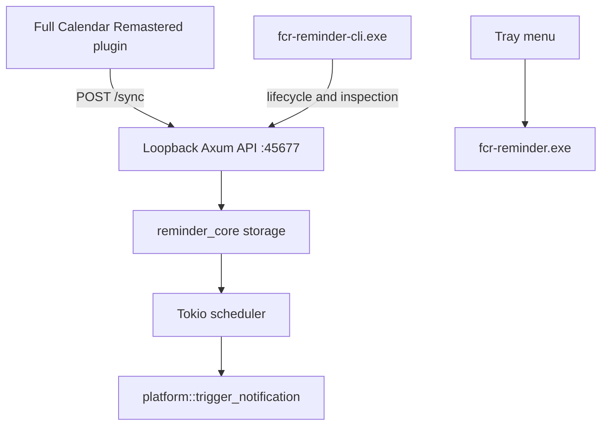

# Runtime Architecture

This document describes the current architecture of FCR Reminder as implemented in this repository today. It is intentionally limited to current behavior, with Windows as the primary supported platform.

## 1. System Purpose

FCR Reminder is a local reminder daemon for Full Calendar Remastered.

Core responsibilities:

1. receive flat reminder instances from the host plugin
2. persist them locally
3. schedule the next reminder efficiently
4. expose local lifecycle and inspection commands
5. trigger native platform notifications when reminders fire

## 2. Architectural Rules

The current implementation follows these rules:

* the host computes reminder instances; the daemon does not parse recurrence rules
* the daemon is local-only and binds to `127.0.0.1:45677`
* Windows release builds are tray-first and GUI-subsystem based
* terminal operations are routed through a separate CLI companion binary
* Windows-specific behavior is isolated under `src/desktop/src/platform/windows`

## 3. Process Model

The desktop crate produces two binaries on Windows:

* `fcr-reminder.exe`
  * primary tray daemon
  * GUI subsystem in release mode
  * owns the HTTP server, scheduler, tray, and platform registration
* `fcr-reminder-cli.exe`
  * console companion
  * forwards lifecycle and inspection commands to the daemon or launches it when needed

On duplicate daemon launch, `fcr-reminder.exe` detects that `127.0.0.1:45677` is already in use and exits after confirming a healthy existing daemon instance.

## 4. High-Level Flow

## 5. Main Runtime Components

### 5.1 `reminder_core`

Shared responsibilities:

* `models.rs`: reminder payload model
* `storage.rs`: app-directory resolution and reminder persistence
* `logger.rs`: file-backed logging and console logging helpers

Storage behavior:

* debug and test builds use workspace-local development storage
* release builds use `AppData/Local/fullcalendar/ReminderApp/data` on Windows

### 5.2 `src/desktop/src/main.rs`

Owns the platform-agnostic daemon control flow:

* argument parsing
* early single-instance check
* Axum router setup
* scheduler task startup
* tray thread bootstrap
* lifecycle command execution
* inspection command execution

### 5.3 Platform Layer

`src/desktop/src/platform/mod.rs` provides the common platform surface.

Current exported responsibilities include:

* `init()`
* `cleanup()`
* `prepare_console_for_cli()`
* `trigger_notification()`
* `doctor_checks()`
* `run_event_loop()`
* `show_about_dialog()` on Windows

Windows-specific implementations live in:

* `windows/console.rs`
* `windows/notification.rs`
* `windows/registry.rs`
* `windows/build_support.rs`

## 6. Control API

The daemon exposes a loopback-only HTTP API.

Implemented routes:

| Route | Method | Purpose |
| :--- | :--- | :--- |
| `/status` | `GET` | health summary and next-event information |
| `/events` | `GET` | full stored reminder list |
| `/next` | `GET` | next scheduled reminder |
| `/storage` | `GET` | resolved storage locations |
| `/doctor` | `GET` | instance, storage, and registration diagnostics |
| `/sync` | `POST` | replace stored reminder set and wake scheduler |
| `/snooze` | `POST` | reschedule a reminder after a snooze action |
| `/lifecycle/start` | `POST` | daemon start acknowledgement endpoint |
| `/lifecycle/stop` | `POST` | clean daemon shutdown |
| `/lifecycle/restart` | `POST` | clean restart |

Security model:

* bind address is `127.0.0.1`
* no remote exposure is intended or supported

## 7. Windows Runtime Integration

### 7.1 Tray And About Experience

The Windows tray menu currently contains:

* `Status: Running`
* `Info`
* `Quit`

`Info` opens the Windows About dialog, which is theme-aware and resizable.

### 7.2 Notifications

Windows notifications are emitted from `platform/windows/notification.rs` and use the Windows notification APIs exposed by the `windows` crate.

### 7.3 Registration

The daemon manages three Windows registrations:

* AppUserModelId: `HKCU\Software\Classes\AppUserModelId\FCRReminder`
* startup Run entry: `HKCU\Software\Microsoft\Windows\CurrentVersion\Run\FCRReminder`
* custom protocol: `HKCU\Software\Classes\fcr-reminder`

Registration behavior:

* first successful startup creates missing registrations
* later startups check first and skip rewriting entries that already exist
* cleanup removes all of them

## 8. Lifecycle Model

Lifecycle entry points:

* `--start`
* `--stop`
* `--restart`
* `--cleanup`

Cleanup behavior is intentionally ordered:

1. detect whether the daemon is running
2. request clean stop
3. wait for the daemon to become unreachable
4. delete Windows registrations
5. remove local app data

This prevents deleting files or registration state while the daemon is still active.

## 9. Verification Strategy

The code-backed lifecycle smoke test lives in `src/desktop/tests/lifecycle_smoke.rs`.

Its scope is intentionally narrow:

* launch daemon
* wait for localhost endpoint to become reachable
* request stop through CLI
* verify daemon endpoint goes away
* verify the daemon child process exits

This is the primary automated regression check for daemon start/stop behavior.
