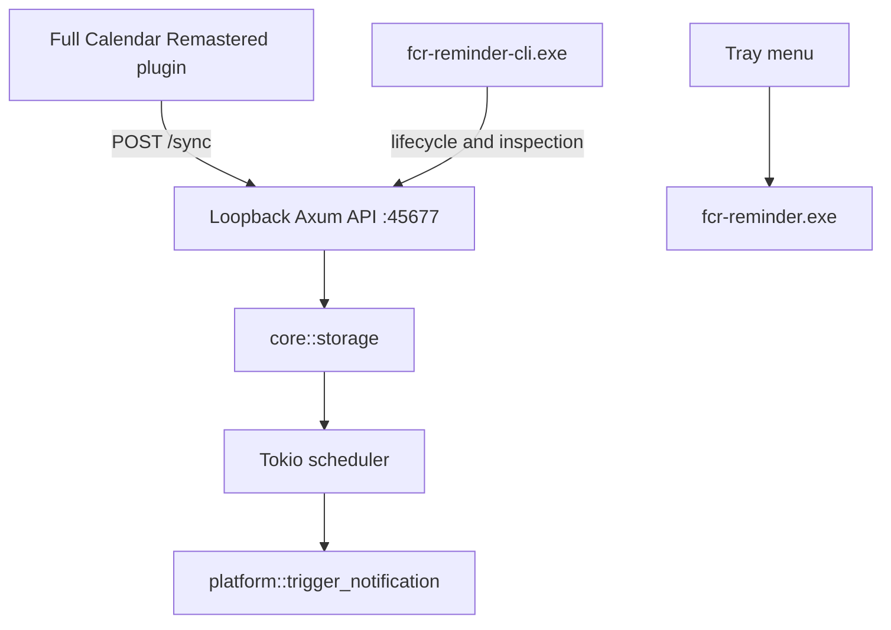

# Runtime Overview

!!! abstract "Runtime Overview"
    This page explains what the daemon is, what it owns, and how the primary runtime pieces fit together. Use the [Architecture Docs router](index.md) when you need the decision matrix and page selection first.

## 1. System Purpose

FCR Reminder is a local reminder daemon for Full Calendar Remastered.

Core responsibilities:

1. receive flat reminder instances from the host plugin
2. persist them locally
3. schedule the next reminder efficiently
4. expose local lifecycle and inspection commands
5. trigger native platform notifications when reminders fire

## 2. Architectural Rules

The current implementation follows these rules:

- the host computes reminder instances; the daemon does not parse recurrence rules
- the daemon is local-only and binds to `127.0.0.1:45677`
- Windows release builds are tray-first and GUI-subsystem based
- terminal operations are routed through a separate CLI companion binary
- platform-specific behavior is isolated under `src/platform/` (e.g. `src/platform/windows/`)
- core logic is isolated under `src/core/`, serving as the single source of truth

!!! note "Single Source of Truth"
    The daemon owns reminder storage and scheduling once the host pushes a `/sync` payload. The host remains responsible for recurrence expansion and future-instance generation.

## 3. Process Model

The unified root-level package produces two binaries:

- `fcr-reminder.exe`
  - primary tray daemon
  - GUI subsystem in release mode
  - owns the HTTP server, scheduler, tray, and platform registration
- `fcr-reminder-cli.exe`
  - console companion
  - forwards lifecycle and inspection commands to the daemon or launches it when needed

On duplicate daemon launch, `fcr-reminder.exe` detects that `127.0.0.1:45677` is already in use and exits after confirming a healthy existing daemon instance.

## 4. High-Level Flow

## 5. Main Runtime Components

### 5.1 Core Logic (`src/core/`)

The single source of truth for FCR Reminder is modularly organized under `src/core/`:

- **`models.rs`**: reminder payload model.
- **`storage.rs`**: app-directory resolution and reminder persistence. Supports local workspace `dev/` directory storage in debug modes.
- **`logger.rs`**: file-backed and console logging macros (`log_info!`, `log_warn!`, `log_error!`).
- **`scheduler.rs`**: background scheduling loop, including duplicate notification prevention (10-minute sliding window) and missed notification recovery.
- **`api.rs`**: loopback HTTP Axum server routes (`/status`, `/events`, `/next`, `/storage`, `/doctor`, `/lifecycle/`, `/sync`, `/snooze`).
- **`commands.rs`**: CLI command executions (health, next, events, storage, doctor checks), lifecycle execution, snooze protocol handling, and system-wide cleanup.
- **`cli.rs`**: forwarded commands execution logic for the console companion.
- **`daemon.rs`**: system tray registration, tray event handlers, asset extraction, and TCP listener binding.

### 5.2 Root Entry Points

The root entry points trigger corresponding core module flows:

- **`src/main.rs`**: Entry point for the tray daemon, calling `core::run_daemon()`.
- **`src/cli_main.rs`**: Entry point for the CLI companion, calling `core::run_cli()`.

### 5.3 Platform Layer

`src/platform/mod.rs` provides a common platform abstraction surface.

Current exported responsibilities include:

- `init()`: performs OS-level autostart and protocol registry setup.
- `cleanup()`: unregisters startup and protocol configurations to leave the OS clean.
- `prepare_console_for_cli()`: attaches or allocates terminal console handles for CLI output.
- `trigger_notification()`: dispatches rich platform native notifications.
- `doctor_checks()`: provides platform diagnostics.
- `run_event_loop()`: runs the GUI event message pump thread.
- `show_about_dialog()`: spawns the styled interactive PowerShell-based GUI dialog.

Platform-specific implementations live in:

- **`src/platform/windows/`**: Console reattachment, WinRT-based interactive Toasts with customizable snooze selections, and winreg registry integration.
- **`src/platform/linux.rs`**: Native D-Bus and system tray integrations.
- **`src/platform/macos.rs`**: macOS Cocoa native runtime bindings.
- **`src/platform/default.rs`**: Fallback wrappers for unrecognized targets.

Compact index: [Architecture Docs](index.md) · [Control API and Lifecycle](control_api.md) · [Windows Runtime](windows_runtime.md) · [Verification Strategy](verification.md) · [Blueprint](blueprint.md)
