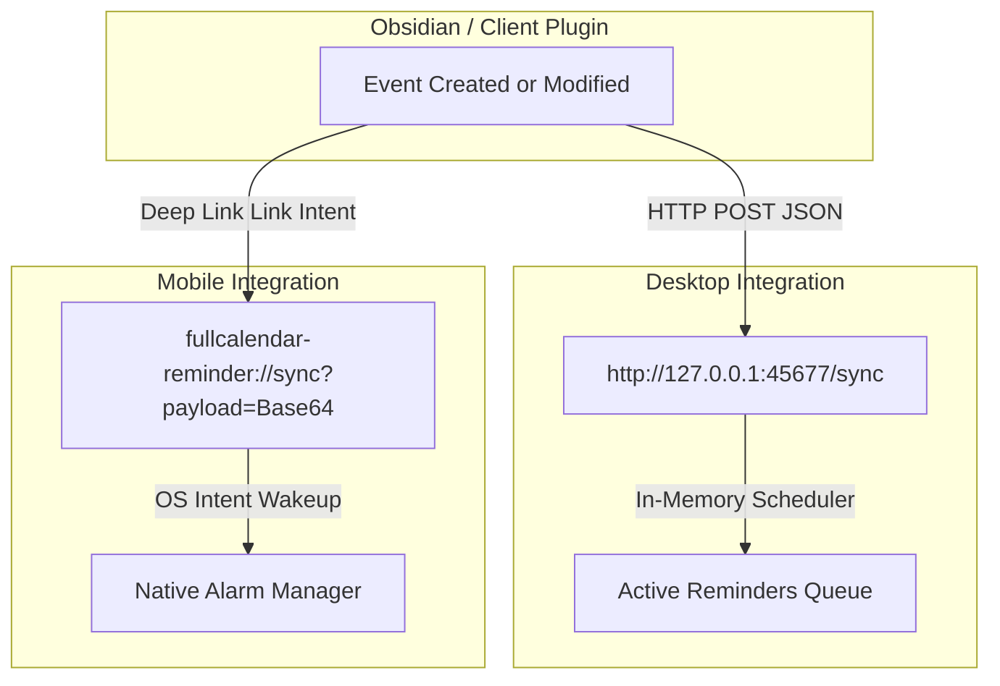

# Developer Integration Blueprint: FCR Reminder Daemon

This document outlines the payload schemas, communication interfaces, and step-by-step implementation rules for third-party plugin/application developers who want to integrate their tools with the persistent **FCR Reminder** background companion daemon.

---

## 1. Overview of FCR Reminder Companion App

The **FCR Reminder** daemon is a highly optimized, resource-efficient background companion service. 
* **Desktop (Windows, Linux, macOS):** It runs persistently in the system tray, hosting a lightweight local HTTP server.
* **Mobile (Android, iOS):** It acts as a passive intent-handler that translates sync payloads into native OS alarm notifications, running only when triggered.

By integrating with FCR Reminder, any plugin (calendar, task manager, or scheduler) can guarantee that event alerts will trigger **natively on the user's desktop/device even when the main host application (e.g., Obsidian) is completely closed.**

---

## 2. Communication Interfaces

Integrations should utilize the appropriate transport channel depending on the execution platform:



### 2.1. Desktop Integration (Local HTTP Server)
All requests must be directed to standard local loopback (secured and sandboxed, inaccessible from the external network):
* **HTTP Sync Port:** `45677`
* **Base URL:** `http://127.0.0.1:45677`

### 2.2. Mobile Integration (Custom Protocol Deep-Linking)
To prevent mobile OS task-killers from destroying active server sockets, integrations on Android or iOS must trigger synchronization by launching a custom system intent:
* **Custom Scheme:** `fullcalendar-reminder://sync`
* **Format:** `fullcalendar-reminder://sync?payload=<BASE64_ENCODED_JSON_STRING>`

---

## 3. Payload Schema Specification

The synchronization endpoint expects a flat JSON array of future reminder objects. **Every synchronization call is destructive:** the daemon overwrites its entire scheduled queue for your plugin with the newly provided list.

### 3.1. JSON Payload Example
```json
[
  {
    "id": "cal-event-992a7e",
    "title": "Project Review Meeting",
    "body": "Synchronize with the development team regarding the Q3 product roadmap.",
    "trigger_at_epoch": 1779308400,
    "action_url": "obsidian://open?vault=PersonalVault&file=Calendar%2FProjectReview"
  }
]
```

### 3.2. Field Definitions

| Field Name | JSON Type | Required | Description |
| :--- | :--- | :---: | :--- |
| `id` | `String` | **Yes** | A unique, stable identifier for this reminder. If an event is updated or deleted, the companion uses this ID for deduplication and cancellation. |
| `title` | `String` | **Yes** | The primary header text shown in the native OS toast notification window. Keep under 64 characters for optimal layout. |
| `body` | `String` | **Yes** | The descriptive body details shown in the OS notification. Keep under 256 characters to avoid system-level truncation. |
| `trigger_at_epoch` | `Integer (i64)` | **Yes** | The **exact Unix Epoch timestamp (in seconds)** when the notification must trigger. Must be a future UTC timestamp. |
| `action_url` | `String` | **Yes** | A system deep-link URL triggered when the user clicks the notification card (e.g. `obsidian://open?...` or a custom website URL). |

---

## 4. Native Toast Interactions & Snooze Protocol

The FCR Reminder companion generates interactive Windows Toast notifications displaying two buttons:

1. **"Open Note" Button:** Directly invokes the `action_url` specified in your payload via the default operating system handler.
2. **"Snooze" Selector Dropdown:** Renders a standard dropdown menu (`5 minutes`, `10 minutes`, `15 minutes`, etc.). Clicking "Snooze" dispatches a custom URI protocol action back to the companion:
   `fcr-reminder://snooze?id=<id>&title=<title>&body=<body>&action_url=<action_url>&snoozeTime=<minutes>`

The companion automatically catches this command, calculates the new epoch, updates the local database store, and schedules a new alert.

---

## 5. Developer Implementation Checklist

To integrate a third-party plugin with FCR Reminder, implement the following four standard procedures on your client-side plugin:

### Step 1: Detect Daemon Status (Active Heartbeat)
Before triggering synchronization, verify if the companion daemon is active by querying the status route:
* **HTTP Method:** `GET`
* **Endpoint:** `http://127.0.0.1:45677/status`
* **Expected Response:** `200 OK`
  ```json
  {
    "status": "running",
    "active_reminders": 0,
    "database_path": "C:\\Users\\...\\reminders.json"
  }
  ```
* **Fallback Strategy:** If the HTTP request fails (connection refused), display a subtle warning banner in the plugin settings prompting the user to launch the persistent **FCR Reminder** desktop tray application.

### Step 2: Extract & Map Events
Implement an event listener in your plugin that monitors event changes (creation, edits, deletion, or vault reloads):
1. Traverse active calendar databases or task sheets.
2. Filter out past events (i.e. where event alarm time $\le$ current system epoch).
3. Extract and map event details into the FCR Reminder payload schema:
   * Map your unique event ID to `id`.
   * Map the event title to `title`.
   * Compile the description or location to `body`.
   * Convert the alarm target time into raw Unix Epoch seconds (`trigger_at_epoch`).
   * Construct the Obsidian protocol link using percent-encoded parameters:
     `obsidian://open?vault=<vault_name>&file=<percent_encoded_vault_relative_path>`

### Step 3: Implement Debounced Synchronization
To prevent system performance degradation and excessive disk I/O when users make multiple consecutive event adjustments:
* **Do not** dispatch a sync request immediately on every keystroke or single event adjustment.
* Implement a **Debounce mechanism** (e.g., `500ms` to `1000ms`).
* Once the event modifications stop, compile the entire flat array of active future alarms and execute a single batch `POST` call:
  * **Endpoint:** `http://127.0.0.1:45677/sync`
  * **Content-Type:** `application/json`
  * **Payload:** `JSON.stringify(remindersQueue)`

### Step 4: Graceful Off-line Execution
* Ensure that the sync helper handles network timeouts gracefully (e.g., maximum `2` seconds timeout) so that Obsidian remains 100% responsive and lag-free, even if the background daemon is frozen or suspended.
